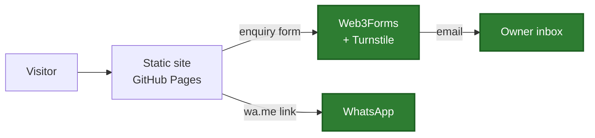

# 🏛️ Masseria Mastrangelo

[](https://github.com/albertocutone/webgen/actions/workflows/ci.yml)

[](LICENSE)

**Marketing site and booking-enquiry funnel for a Puglian masseria.**
Static, prerendered, bilingual, and free to host.

🔗 **<https://albertocutone.github.io/webgen/>**

---

## What this is

Phase 1 of a two-phase build (see [`docs/design.md`](docs/design.md)). A custom
booking engine with date-conflict logic is genuinely hard, and building it first
would delay the far more valuable outcome — being online and reachable. So:

|         | Phase 1 — **shipped**                  | Phase 2 — deferred                 |
| ------- | -------------------------------------- | ---------------------------------- |
| Booking | "Request to book" form → owner's inbox | Live availability + Stripe deposit |
| State   | None. Static files on a CDN            | PostgreSQL                         |
| Hosting | GitHub Pages                           | Node host + managed Postgres       |

Phase 1 is designed so Phase 2 throws nothing away: the enquiry form's fields
are a subset of the future `BOOKING` entity, and `src/lib/web3forms.js` is the
only place the app touches the network.

## Quickstart

```bash
npm install
npm run dev          # http://localhost:5173
```

```bash
npm run verify       # lint + format check + unit tests + build — run before committing
npm run test:e2e     # Playwright (see caveat below)
```

## Scripts

| Script     | Does                                                              |
| ---------- | ----------------------------------------------------------------- |
| `dev`      | Vite dev server with HMR                                          |
| `build`    | Client build → SPA 404 fallback → SSR build → prerender → sitemap |
| `verify`   | The pre-commit gate: `lint && format:check && test && build`      |
| `test`     | Jest + React Testing Library                                      |
| `test:e2e` | Playwright, against the production build via `vite preview`       |
| `format`   | Prettier write                                                    |

## Architecture



Single sources of truth, so things cannot drift apart:

- **`src/routes.js`** — every route. Feeds the router, header nav, footer,
  sitemap generator, prerenderer and E2E suite.
- **`src/content/{it,en}/site.js`** — all copy, no JSX. A test asserts both
  locales expose identical key paths.
- **`src/lib/config.js`** — build-time keys, injected via Vite `define`.

Rendering is a hybrid: every route is **prerendered to static HTML** at build
time so crawlers that do not execute JS still see real content, then the
browser boots the SPA over it.

## Testing

| Layer                  | Tool                                       | Runs              |
| ---------------------- | ------------------------------------------ | ----------------- |
| Unit                   | Jest + RTL                                 | Locally and in CI |
| E2E — desktop + mobile | Playwright (Chromium, WebKit)              | **CI only**       |
| E2E — no-JavaScript    | Playwright with `javaScriptEnabled: false` | **CI only**       |

The no-JS project is the guard on prerendering: it asserts real `<h1>`s,
metadata and crawlable links on every route, and fails outright if prerendering
regresses.

> **E2E cannot run on the primary dev machine.** Its endpoint security SIGKILLs
> Playwright's browsers (`kill EPERM` / `Killed: 9`), regardless of sandbox
> settings. CI publishes a `screenshots/` artifact instead, which is how
> rendering gets reviewed:
>
> ```bash
> gh run download <run-id> -n screenshots -D /tmp/shots
> ```

## Deployment

Push to `main` → GitHub Actions runs lint, unit tests, build and E2E, and
deploys to Pages only if all of it passes.

## Status

Phase 1 is feature-complete and live, but shows **placeholder content**. See
[`docs/CONTENT.md`](docs/CONTENT.md) for the checklist of what the owner still
needs to supply — photography, real copy, contact details, and the Web3Forms
and Turnstile keys that let the form actually send mail.

## Licence

MIT — see [LICENSE](LICENSE).
