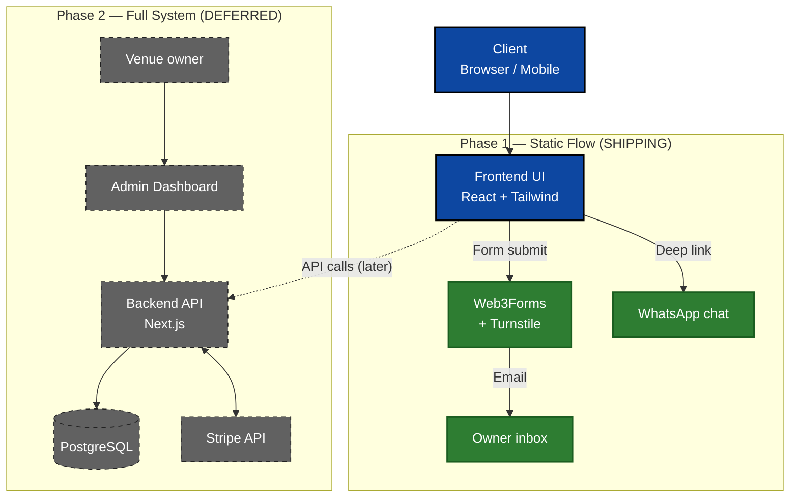
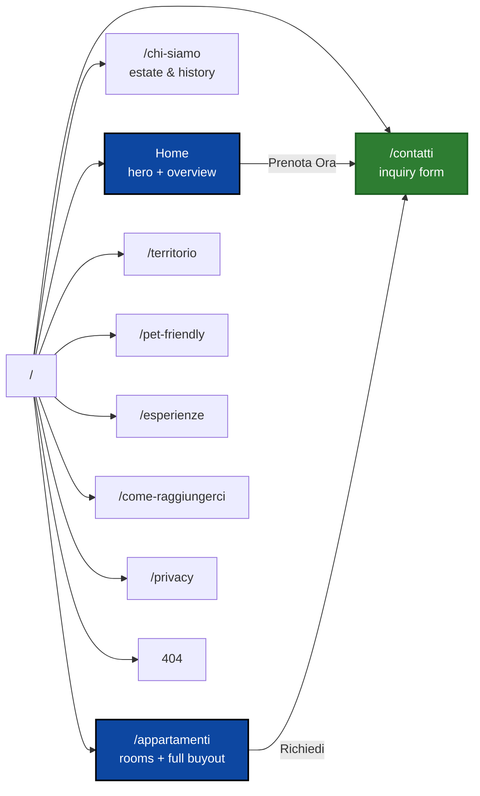
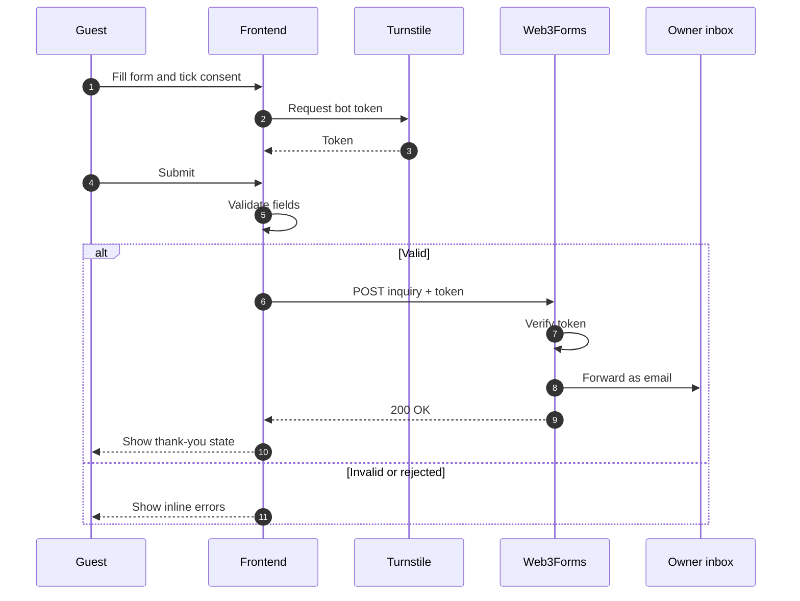
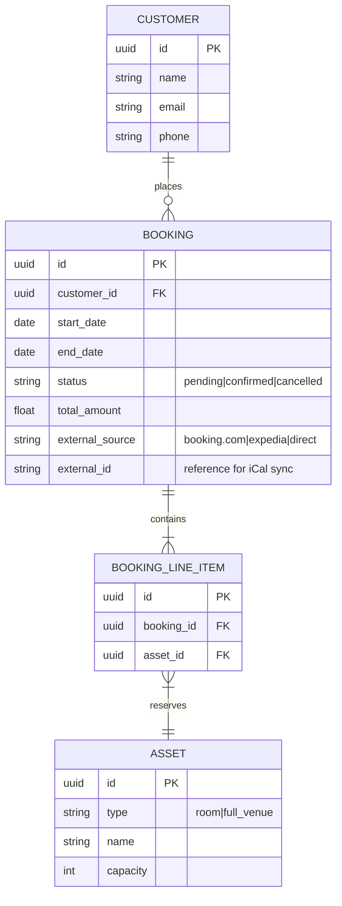
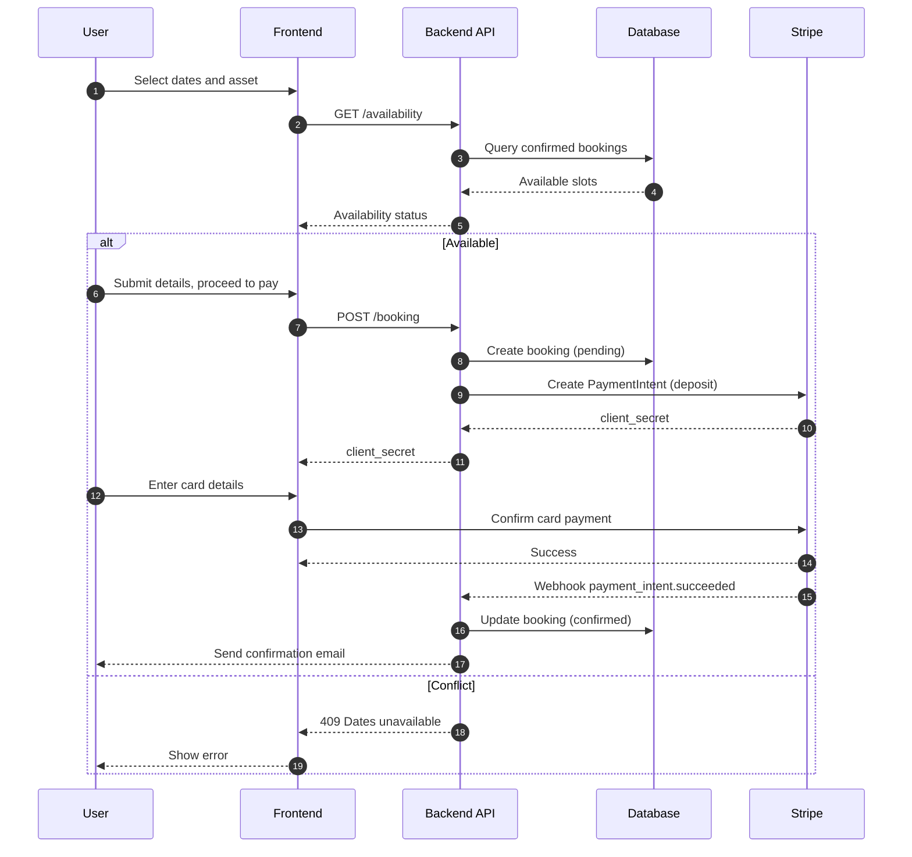
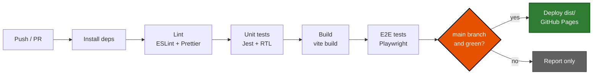

# Masseria Mastrangelo — System Design

**Project:** Marketing website and booking-inquiry funnel for the Masseria Mastrangelo venue
**Status:** Phase 1 design — approved for implementation
**Last updated:** 2026-09-07

---

## Table of Contents

- [0. Documentation Style & Conventions](#0-documentation-style--conventions)
- [1. Executive Summary](#1-executive-summary)
- [2. Scope & Requirements](#2-scope--requirements)
- [3. Technology Stack](#3-technology-stack)
- [4. High-Level Architecture](#4-high-level-architecture)
- [5. Phase 1 — Frontend Architecture](#5-phase-1--frontend-architecture)
- [6. Phase 2 — Backend Architecture (Deferred)](#6-phase-2--backend-architecture-deferred)
- [7. SEO & Performance](#7-seo--performance)
- [8. Repository Structure](#8-repository-structure)
- [9. Implementation & SCM Plan](#9-implementation--scm-plan)
- [10. Risks, Trade-offs & Open Questions](#10-risks-trade-offs--open-questions)
- [11. Future Improvements](#11-future-improvements)
- [Changelog](#changelog)

---

<details id="0-documentation-style--conventions">
<summary><strong>0. Documentation Style & Conventions</strong></summary>

- Use **clear, concise, unambiguous language**; prefer **bullet points** over paragraphs
- Highlight **key terms** in bold; use **tables** for comparisons, trade-offs and structured data
- Use **Mermaid** in fenced ` ```mermaid ` blocks so diagrams render on GitHub
- Keep node labels **short**; put explanation in prose _below_ the diagram, not inside it
- Keep sections **self-contained** so they can be read and updated independently
- Explicitly mark **assumptions**, **constraints**, **out-of-scope** items and **TBD**s
- Every significant architectural decision carries a **rationale**

</details>

---

<details id="1-executive-summary">
<summary><strong>1. Executive Summary</strong></summary>

The Masseria Mastrangelo website provides a professional online presence for the estate, showcases the
venue and its accommodations, and converts visitors into booking inquiries.

A custom booking engine with date-conflict resolution is a genuinely hard problem (overlapping
reservations, full-venue vs. per-room collisions, payment state machines, channel sync). Building it up
front would block the far more valuable outcome — **being online and reachable**. The lifecycle is
therefore split into two strictly sequenced phases.

### 🔴 Implementation Strategy — Phased Approach

|                   | **Phase 1 — Static Frontend**              | **Phase 2 — Full-Stack**                |
| ----------------- | ------------------------------------------ | --------------------------------------- |
| **Status**        | ✅ Current scope                           | ⏸️ Deferred                             |
| **Goal**          | Be online, look premium, capture inquiries | Automate availability and payment       |
| **Booking model** | "Request to Book" form → owner's email     | Live availability + deposit at checkout |
| **State**         | Stateless — no database                    | PostgreSQL, authoritative availability  |
| **Payments**      | None (handled offline by owner)            | Stripe PaymentIntents + webhooks        |
| **Admin**         | None (owner reads email)                   | Admin dashboard for calendar & bookings |
| **Hosting**       | GitHub Pages (static)                      | Node host + managed Postgres            |

**Guiding principle:** Phase 1 must not create work that Phase 2 has to throw away. The inquiry form's
data model (see §5.4) is deliberately a subset of the Phase 2 `BOOKING` entity (see §6.1).

</details>

---

<details id="2-scope--requirements">
<summary><strong>2. Scope & Requirements</strong></summary>

### Functional Requirements — Phase 1

| ID      | Requirement                                                 | Priority |
| ------- | ----------------------------------------------------------- | -------- |
| **F1**  | Multi-page marketing site with persistent header navigation | P0       |
| **F2**  | Booking-inquiry form that emails the owner reliably         | P0       |
| **F3**  | GDPR consent checkbox + linked Privacy Policy page          | P0       |
| **F4**  | Bot protection on the inquiry form                          | P0       |
| **F5**  | Cookie-consent banner (EU compliant)                        | P0       |
| **F6**  | Fully responsive layout (mobile-first)                      | P0       |
| **F7**  | Floating WhatsApp contact button                            | P1       |
| **F8**  | FAQ accordion (check-in, pets, parking)                     | P1       |
| **F9**  | EN / IT language toggle                                     | P1       |
| **F10** | Premium page/scroll transitions                             | P2       |

**Priority key:** P0 = must-have for launch · P1 = important, can ship without · P2 = nice-to-have

### Non-Functional Requirements

| Category            | Target                                                                      |
| ------------------- | --------------------------------------------------------------------------- |
| **Performance**     | Lighthouse ≥ 90 on all four categories; LCP < 2.5 s on 4G                   |
| **Accessibility**   | WCAG 2.1 AA — keyboard-navigable nav, form labels, visible focus            |
| **SEO**             | Indexable static HTML, per-page meta, `sitemap.xml`, `robots.txt`           |
| **Compliance**      | GDPR — explicit consent before submit, no non-essential cookies pre-consent |
| **Availability**    | Static hosting; no server to fail. Form outage degrades to WhatsApp/email   |
| **Maintainability** | Owner-editable copy isolated in content files, not in JSX                   |

### Out of Scope (Phase 1)

- Live availability calendar, date-conflict logic, online payment
- User accounts, login, or an admin dashboard
- Channel-manager sync with Booking.com / Expedia
- Any server-side code or database

### Assumptions

- Copy, photography and pricing are supplied by the owner; the site does not generate content
- The owner monitors an email inbox and a WhatsApp number as the inquiry SLA
- Traffic is low enough (< 100k views/month) that GitHub Pages is sufficient
- A custom domain will be pointed at GitHub Pages (**TBD**: domain name)

</details>

---

<details id="3-technology-stack">
<summary><strong>3. Technology Stack</strong></summary>

### Phase 1 — Static Frontend (current scope)

| Concern            | Choice                       | Rationale                                                           |
| ------------------ | ---------------------------- | ------------------------------------------------------------------- |
| **Framework**      | Vite + React                 | Fast HMR, minimal config, first-class static build                  |
| **Routing**        | React Router                 | Multi-page URLs without a server (see §5.2 for the GH Pages caveat) |
| **Styling**        | Tailwind CSS                 | Rapid iteration, responsive utilities, no CSS-file sprawl           |
| **Animation**      | Framer Motion                | Premium transitions, declarative, tree-shakeable                    |
| **Forms**          | Web3Forms                    | Serverless email forwarding — no backend to run                     |
| **Bot protection** | Cloudflare Turnstile         | Privacy-friendly, no image puzzles, free tier                       |
| **Unit tests**     | Jest + React Testing Library | Component logic, consent-checkbox state, banner state               |
| **E2E tests**      | Playwright                   | Real form submission, navigation, responsive viewports              |
| **Lint/format**    | ESLint + Prettier            | Enforced in CI                                                      |
| **Hosting**        | GitHub Pages                 | Free, static, integrates with GitHub Actions                        |

### Phase 2 — Full-Stack (future scope)

| Concern       | Choice               | Rationale                                                        |
| ------------- | -------------------- | ---------------------------------------------------------------- |
| **Framework** | Next.js + TypeScript | SSR for booking pages, API routes, types for money/date logic    |
| **Database**  | PostgreSQL           | Relational integrity + exclusion constraints for date collisions |
| **Payments**  | Stripe               | PaymentIntents, webhooks, EU SCA compliance built in             |
| **Auth**      | TBD (owner-only)     | Single-tenant admin; a managed provider is likely sufficient     |

</details>

---

<details id="4-high-level-architecture">
<summary><strong>4. High-Level Architecture</strong></summary>

The diagram shows the end-state (Phase 2) alongside the Phase 1 bypass that ships first.
**Green = Phase 1, live now. Grey/dashed = Phase 2, deferred.**



**Notes**

- In Phase 1 the frontend has **no origin server of its own** — it is a bundle of static files on a CDN.
- The dashed `FE -.-> BE` edge is the single integration point Phase 2 introduces; everything else in
  Phase 1 (pages, components, styling, SEO) is reused unchanged.
- WhatsApp is a `wa.me` deep link, not an integration — zero backend cost, immediate owner response.

</details>

---

<details id="5-phase-1--frontend-architecture">
<summary><strong>5. Phase 1 — Frontend Architecture</strong></summary>

### 5.1 Global UI Components

Modelled on the reference layout (see `docs/assets/reference-header.png` — **TBD**: commit the
reference image, previously tracked only as `image_761202.png`).

| Component           | Placement               | Behaviour                                                                   |
| ------------------- | ----------------------- | --------------------------------------------------------------------------- |
| **Header**          | Persistent, top         | Left: logo · Centre: page links · Right: EN/IT toggle + **Prenota Ora** CTA |
| **Mobile nav**      | Header, < `md`          | Hamburger → full-screen overlay menu                                        |
| **WhatsApp button** | Sticky, bottom-right    | Opens `wa.me` chat with the owner in a new tab                              |
| **Cookie banner**   | Bottom, first visit     | Accept / decline non-essential cookies; choice persisted in `localStorage`  |
| **FAQ accordion**   | Section, multiple pages | Keyboard-accessible disclosure widgets (check-in, pets, parking)            |
| **Footer**          | Bottom, all pages       | Contacts, address, social, Privacy Policy + Cookie Policy links             |

### 5.2 Routing & Views



**Notes**

- **Every path leads to `/contatti`** — it is the single conversion point of the site.
- **GitHub Pages caveat:** static hosting returns 404 for deep links like `/appartamenti`. Mitigation:
  copy `index.html` to `404.html` at build time (SPA fallback) and set Vite's `base` correctly. A
  `HashRouter` would also work but produces uglier, less SEO-friendly URLs — rejected.

### 5.3 Component Design Principles

- **Component-driven / OOD** — one responsibility per component, composed upward
- **Separate concerns** — `components/` (dumb, reusable) vs. `pages/` (composition + data) vs. `content/` (copy)
- **No global state** — Phase 1 needs none. Local `useState` + a single `CookieConsentContext`
- **Avoid over-engineering** — no Redux, no data-fetching library, no CMS

### 5.4 Inquiry Form — Data, Security & Compliance

**Collected fields**

| Field                          | Required | Maps to Phase 2                   |
| ------------------------------ | -------- | --------------------------------- |
| Name                           | ✅       | `CUSTOMER.name`                   |
| Email                          | ✅       | `CUSTOMER.email`                  |
| Phone                          | ❌       | `CUSTOMER.phone`                  |
| Desired dates (from / to)      | ✅       | `BOOKING.start_date` / `end_date` |
| Event type / asset of interest | ✅       | `BOOKING_LINE_ITEM.asset_id`      |
| Message                        | ❌       | —                                 |
| GDPR consent                   | ✅       | —                                 |

**Controls**

- **Bot protection** — Cloudflare Turnstile widget; submission blocked until the token resolves
- **GDPR consent** — mandatory, unticked-by-default checkbox immediately above the submit button,
  linking to `/privacy`. Submit stays disabled until it is ticked
- **No pre-consent tracking** — analytics scripts load only after the cookie banner is accepted
- **Client-side validation** — required fields, email format, `end_date > start_date`

### 5.5 Inquiry Flow



**Notes**

- Failure of Web3Forms is user-visible: on non-200 the UI surfaces the owner's email and WhatsApp
  as a manual fallback, so no inquiry is silently lost.
- Web3Forms sends no confirmation to the guest in Phase 1; the owner replies manually.

</details>

---

<details id="6-phase-2--backend-architecture-deferred">
<summary><strong>6. Phase 2 — Backend Architecture (Deferred)</strong></summary>

### 6.1 Database Schema

The core difficulty: a **full-venue** booking conflicts with every **individual room** booking on
overlapping dates, and vice versa. Modelling both as `ASSET` rows joined through
`BOOKING_LINE_ITEM` lets a single overlap query answer both cases. The `external_*` fields exist so
bookings imported from OTAs (Booking.com, Expedia) occupy the same calendar as direct bookings.



**Notes**

- A **full-venue** `ASSET` is expanded at booking time into line items for every room it contains, so
  collisions are detected by a plain overlap query rather than special-case logic.
- Integrity should be enforced in the database (a Postgres `EXCLUDE` constraint over
  `asset_id` + `daterange`), not only in application code — concurrent requests otherwise race.
- `total_amount` should be `numeric`, not `float`, in the real schema — money must not be binary FP.

### 6.2 Automated Booking & Payment Flow



**Notes**

- Booking is only **confirmed by the webhook**, never by the browser's success callback — the client
  is untrusted and may close the tab mid-redirect.
- `pending` bookings must expire (e.g. 20 min TTL) or abandoned checkouts hold dates hostage.
- Availability is re-checked inside the transaction that creates the booking; the earlier
  `GET /availability` is advisory only.

</details>

---

<details id="7-seo--performance">
<summary><strong>7. SEO & Performance</strong></summary>

| Area                | Approach                                                                                                                     |
| ------------------- | ---------------------------------------------------------------------------------------------------------------------------- |
| **Semantic HTML**   | Strict `<header>`, `<main>`, `<nav>`, `<section>`, `<article>`; one `<h1>` per page, logical H1–H3                           |
| **Meta data**       | Per-page `<title>` and `<meta name="description">` tuned for IT and EN intents; Open Graph + Twitter cards for link previews |
| **Structured data** | JSON-LD `LodgingBusiness` / `Hotel` schema with address, geo, amenities                                                      |
| **Technical SEO**   | Generated `sitemap.xml` and `robots.txt`; `hreflang` for IT/EN once i18n lands; canonical URLs                               |
| **Images**          | WebP/AVIF, explicit `width`/`height` to prevent CLS, `loading="lazy"` below the fold, hero preloaded                         |
| **Budget**          | JS < 200 KB gzipped; Lighthouse ≥ 90 enforced in CI (**TBD**: warn vs. fail)                                                 |

**Caveat:** a client-rendered SPA ships an empty `<div id="root">` to crawlers. Google executes JS, but
other crawlers and social scrapers often do not. Mitigation for Phase 1: prerender the routes at build
time (`vite-plugin-ssg` or equivalent) so each page emits real HTML. This is a **P0 for SEO** and is
folded into the build step, not deferred.

</details>

---

<details id="8-repository-structure">
<summary><strong>8. Repository Structure</strong></summary>

Follows the conventions used across the sibling projects in `~/local/projects` (`docs/`, `src/`,
`tests/`, `scripts/`, `.github/workflows/`, top-level `README.md` + `LICENSE`).

```text
webgen/
├── .github/
│   └── workflows/
│       └── ci.yml                  # lint → unit → e2e → build → deploy
├── docs/
│   ├── design.md                   # this document
│   ├── CONTENT.md                  # copy/asset checklist for the owner
│   └── assets/
│       └── reference-header.png    # layout reference
├── assets/                         # build inputs, not served directly
│   ├── brand/logo.jpg              # -> header mark, favicons, social card
│   ├── photos/                     # -> responsive WebP in public/images
│   └── source/                     # raw material, never committed (see assets/README.md)
├── public/                         # copied verbatim to the build output
│   ├── favicon.svg
│   ├── robots.txt
│   ├── CNAME                       # custom domain for GitHub Pages
│   └── images/                     # photography (WebP)
├── src/
│   ├── main.jsx                    # entry point
│   ├── App.jsx                     # layout shell + route outlet
│   ├── router.jsx                  # route table
│   ├── components/
│   │   ├── layout/                 # Header, Footer, MobileNav, LanguageToggle
│   │   ├── common/                 # Button, Card, Accordion, Section, Seo
│   │   ├── booking/                # InquiryForm, ConsentCheckbox, TurnstileWidget
│   │   └── overlays/               # WhatsAppButton, CookieBanner
│   ├── pages/
│   │   ├── Home.jsx
│   │   ├── ChiSiamo.jsx
│   │   ├── Appartamenti.jsx
│   │   ├── Territorio.jsx
│   │   ├── PetFriendly.jsx
│   │   ├── Esperienze.jsx
│   │   ├── ComeRaggiungerci.jsx
│   │   ├── Contatti.jsx
│   │   ├── Privacy.jsx
│   │   └── NotFound.jsx
│   ├── content/                    # owner-editable copy, no JSX
│   │   ├── it/
│   │   └── en/
│   ├── hooks/                      # useCookieConsent, useLocale, useMediaQuery
│   ├── lib/                        # web3forms.js, seo.js, constants.js
│   └── styles/
│       └── index.css               # Tailwind entry + design tokens
├── tests/
│   ├── unit/                       # Jest + React Testing Library
│   └── e2e/                        # Playwright specs
├── scripts/
│   ├── postbuild.mjs               # copies index.html -> 404.html (SPA fallback)
│   └── generate-sitemap.mjs
├── index.html
├── package.json
├── vite.config.js
├── jest.config.cjs
├── babel.config.cjs                # babel-jest only; Vite never reads it
├── playwright.config.js
├── eslint.config.js
├── .prettierrc.json
├── .nvmrc
├── .env.example                    # WEB3FORMS_KEY, TURNSTILE_SITE_KEY
├── .gitignore
├── LICENSE
└── README.md
```

**Deviation from the original tree:** Tailwind v4 is configured in CSS via `@theme` inside
`src/styles/index.css` and loaded through `@tailwindcss/vite`, so the planned `tailwind.config.js`
and `postcss.config.js` do not exist. Jest and Babel configs are `.cjs` because `package.json` sets
`"type": "module"`.

### Rationale

| Decision                                                                    | Why                                                                                          |
| --------------------------------------------------------------------------- | -------------------------------------------------------------------------------------------- |
| `components/` split by **role** (`layout`, `common`, `booking`, `overlays`) | Flat component folders rot fast; role grouping keeps the booking funnel isolated for Phase 2 |
| `content/{it,en}/` from day one                                             | Makes the P1 language toggle a data swap, and i18n a drop-in later                           |
| `tests/` at top level, not co-located                                       | Matches the sibling projects; keeps `src/` shippable and the Playwright/Jest split obvious   |
| `lib/web3forms.js` as the only network call site                            | Phase 2 replaces this one module with an API client                                          |
| `public/CNAME` committed                                                    | GitHub Pages drops the custom domain on every deploy unless the file is in the build output  |

</details>

---

<details id="9-implementation--scm-plan">
<summary><strong>9. Implementation & SCM Plan</strong></summary>

### Source Control

- **Git + GitHub**, `main` as the deployable branch
- **Atomic, conventional commits** — `feat: add WhatsApp button`, `fix: header padding`
- **Short-lived feature branches** merged via PR; CI must be green to merge

### CI/CD Pipeline



**Notes**

- E2E runs **after** the build against the built artifact, not the dev server — it tests what ships.
- Secrets (`WEB3FORMS_KEY`, `TURNSTILE_SITE_KEY`) are injected as GitHub Actions secrets at build time.
  Both are **public-by-design client keys**; they end up in the bundle and must not be treated as
  confidential. Nothing secret may ever enter this repository.

### Delivery Order (Phase 1)

| #   | Milestone                                     | Exit criterion                              |
| --- | --------------------------------------------- | ------------------------------------------- |
| 1   | Scaffold + CI + deploy skeleton               | Blank page live on GitHub Pages via Actions |
| 2   | Layout shell — header, footer, routing        | All routes reachable, deep links work       |
| 3   | Home + Appartamenti with real content         | Owner signs off on look and copy            |
| 4   | Inquiry form + Turnstile + consent            | Test inquiry lands in the owner's inbox     |
| 5   | Remaining pages, FAQ, WhatsApp, cookie banner | F1–F9 complete                              |
| 6   | SEO, prerender, image optimisation            | Lighthouse ≥ 90 across the board            |
| 7   | Polish — Framer Motion transitions            | Launch                                      |

</details>

---

<details id="10-risks-trade-offs--open-questions">
<summary><strong>10. Risks, Trade-offs & Open Questions</strong></summary>

| Risk                                   | Impact                                        | Mitigation                                                                                         |
| -------------------------------------- | --------------------------------------------- | -------------------------------------------------------------------------------------------------- |
| **Web3Forms outage or spam-foldering** | Inquiries lost silently — direct revenue loss | Surface email + WhatsApp fallback on submit failure; owner verifies inbox monthly                  |
| **SPA renders empty HTML to crawlers** | Poor SEO — the site's main purpose fails      | Prerender routes at build time (§7); verify with a fetch-as-crawler check                          |
| **Deep links 404 on GitHub Pages**     | Shared links break                            | `404.html` SPA fallback + correct Vite `base`                                                      |
| **Jest + Vite/ESM friction**           | Slow test setup, config drift                 | Accepted as specified. Vitest is the native pairing and a drop-in swap if config cost becomes real |
| **Content not ready**                  | Blocks milestones 3–5                         | `docs/CONTENT.md` checklist owned by the venue owner; build against placeholders                   |
| **Manual date blocking in Phase 1**    | Double-booking with OTAs                      | Explicitly out of scope; owner keeps a single master calendar until Phase 2                        |
| **Phase 2 never happens**              | Site stays a brochure                         | Acceptable — Phase 1 is independently valuable and complete                                        |

### Build Environment Constraints (discovered during M1)

The development machine is a managed laptop with endpoint security that blocks unsigned and
system-level binaries. Two consequences shape the workflow:

| Constraint                         | Evidence                                                                                                 | Workaround                                                                                                                                               |
| ---------------------------------- | -------------------------------------------------------------------------------------------------------- | -------------------------------------------------------------------------------------------------------------------------------------------------------- |
| **Homebrew cannot install**        | `touch /opt/homebrew/Cellar` → `Operation not permitted` (EPERM) despite `albertocutone:admin` ownership | Node 24.20.0 installed user-local to `~/.local/node` from the official tarball, SHA-256 verified. Removable with `rm -rf ~/.local/node`                  |
| **Playwright browsers are killed** | Chromium `kill EPERM`, WebKit `Killed: 9` (exit 137), unchanged with the tool sandbox disabled           | **E2E is CI-only.** The `e2e` job uploads `screenshots/` as an artifact; visual review happens by downloading it (`gh run download <id> -n screenshots`) |

**Implication for the workflow:** locally verifiable per commit = lint, format, unit tests, build.
Rendering and E2E are verified on the CI round-trip, and `deploy` gates on both.

### Open Questions (TBD)

- Custom domain name and DNS ownership
- Number of rooms and whether the "full venue buyout" is a distinct sellable asset at launch
- Whether pricing is published on the site or quoted per inquiry
- Analytics provider, if any (affects the cookie banner's categories)
- Lighthouse CI: fail the build or warn only

</details>

---

<details id="11-future-improvements">
<summary><strong>11. Future Improvements</strong></summary>

| Improvement                   | Description                                                                        | Depends on                                                   |
| ----------------------------- | ---------------------------------------------------------------------------------- | ------------------------------------------------------------ |
| **Multi-language i18n**       | Dynamic translation across all pages via `react-i18next`, `hreflang` tags          | `content/{it,en}` structure (already in place)               |
| **Channel-manager sync**      | iCal/API sync with Booking.com and Expedia to eliminate manual date blocking       | Phase 2 database                                             |
| **Interactive 3D tour**       | WebGL/Three.js walkthrough of the estate and rooms                                 | Photogrammetry assets; performance budget review             |
| **Guest confirmation emails** | Auto-acknowledge inquiries so guests know they were received                       | Phase 2 backend (or a Web3Forms autoresponder as an interim) |
| **Owner content editing**     | Lightweight CMS or Markdown-in-repo editing so copy changes don't need a developer | Content model stability                                      |

</details>

---

## Phase 1 Progress

Live site: <https://albertocutone.github.io/webgen/>

| #   | Milestone                                     | Status                                         |
| --- | --------------------------------------------- | ---------------------------------------------- |
| 1   | Scaffold + CI + deploy skeleton               | ✅ Done                                        |
| 2   | Layout shell — header, footer, routing        | ✅ Done                                        |
| 3   | Home + Appartamenti with real content         | ✅ Done — real rooms, contacts and photography |
| 4   | Inquiry form + Turnstile + consent            | ✅ Done                                        |
| 5   | Remaining pages, FAQ, WhatsApp, cookie banner | ✅ Done                                        |
| 6   | SEO, prerender, image optimisation            | ✅ Done                                        |
| 7   | Polish — Framer Motion transitions            | ✅ Done                                        |

### Requirement coverage

| ID  | Requirement                   | Status                                 |
| --- | ----------------------------- | -------------------------------------- |
| F1  | Multi-page nav                | ✅                                     |
| F2  | Inquiry form emails owner     | 🟡 Built; needs the live Web3Forms key |
| F3  | GDPR consent + Privacy Policy | ✅                                     |
| F4  | Bot protection                | 🟡 Built; needs the live Turnstile key |
| F5  | Cookie banner                 | ✅                                     |
| F6  | Responsive layout             | ✅                                     |
| F7  | WhatsApp button               | 🟡 Built; needs the real number        |
| F8  | FAQ accordion                 | ✅                                     |
| F9  | EN/IT toggle                  | ✅                                     |
| F10 | Transitions                   | ✅                                     |

### Blocked / awaiting input

| What                          | Needed from you                                               | Blocks                                                                                                    |
| ----------------------------- | ------------------------------------------------------------- | --------------------------------------------------------------------------------------------------------- |
| **Venue photography**         | Export from the Google Business Profile into `public/images/` | M3 hero and room imagery; the image-optimisation half of M6                                               |
| **`VITE_WEB3FORMS_KEY`**      | Web3Forms access key, added as a GitHub Actions secret        | F2 — the form is built and tested but cannot deliver mail; it currently shows the direct-contact fallback |
| **`VITE_TURNSTILE_SITE_KEY`** | Cloudflare Turnstile site key                                 | F4 — bot protection is wired but inactive                                                                 |
| **Real contact details**      | Email, phone and WhatsApp number                              | `src/lib/constants.js` still holds placeholders (`+39 000 000 0000`)                                      |
| **Owner copy**                | Real page text and FAQ answers                                | All page leads and FAQ answers are placeholders                                                           |
| **Custom domain**             | Domain name and DNS access                                    | `public/CNAME`, and the `SITE_URL` used by canonicals and the sitemap                                     |
| **Room inventory / pricing**  | How many units, and whether prices are public                 | M3 Appartamenti page structure                                                                            |

---

## Changelog

| Date       | Change                                                                                                                                                                                                                                                                                                                                                                                                                                                                                                                                                                                                                            |
| ---------- | --------------------------------------------------------------------------------------------------------------------------------------------------------------------------------------------------------------------------------------------------------------------------------------------------------------------------------------------------------------------------------------------------------------------------------------------------------------------------------------------------------------------------------------------------------------------------------------------------------------------------------- |
| 2026-09-08 | **Brand assets.** The venue's logo now sits in the header, with the mark knocked out of its white JPEG background via a luminance-derived alpha channel rather than a colour key. Also generates favicon, apple-touch-icon and a 1200×630 social preview card cropped from the hero — there was no `og:image` at all, so shared links previewed as bare text. Fixed a mobile regression the logo introduced (the CTA painted over the wordmark) and added an E2E bounding-box overlap guard, which the existing `scrollWidth` check could never have caught.                                                                      |
| 2026-09-07 | **Real venue data imported.** Replaced all placeholder content using the owner's saved Facebook export and Google Hotels listing. The site had the wrong region entirely (Puglia); it is an agriturismo and 3-star B&B at Via Portelle 17, Prata Sannita (CE), Campania, in the Matese with the castle facing its garden. Real contacts, five actual room types (the invented "Il Trullo" and friends are gone), verified amenities, events-only framing — it is **not** a walk-in restaurant — nearby places, drive times, and five of the owner's own photographs. JSON-LD is now BedAndBreakfast with the full postal address. |
| 2026-09-07 | **M3 structure + M7 complete. Phase 1 code-complete.** Home hero with dual CTAs over a scrimmed image, Appartamenti unit-card grid, shared `Image` component enforcing explicit dimensions and a lazy/eager policy. Framer Motion route transitions with `initial={false}` so prerendered HTML is never emitted at `opacity:0`, and motion dropped under `prefers-reduced-motion`. Added README, `docs/CONTENT.md` owner checklist and LICENSE. 126 unit tests, 79 E2E across desktop/mobile/no-JS.                                                                                                                               |
| 2026-09-07 | **M6 (SEO) complete.** Per-route titles/descriptions derived from page copy and clamped to Google's limits, Open Graph, canonical, LodgingBusiness JSON-LD, generated `sitemap.xml` + `robots.txt`. Every route is prerendered to static HTML at build time, emitted at both `/path` and `/path/` so canonicals never point at a redirect. Guarded by a Playwright project running with JavaScript disabled. Live site verified serving prerendered HTML on all routes.                                                                                                                                                           |
| 2026-09-07 | **M5 complete.** EU cookie banner (equal-weight accept/decline, consent persisted, layout padding so it never covers content), floating WhatsApp button (plain `wa.me` link — no SDK, no cookies), FAQ accordion on native `<details>` so answers stay crawlable while collapsed.                                                                                                                                                                                                                                                                                                                                                 |
| 2026-09-07 | **M4 complete.** Booking inquiry form: pure reusable validation, labelled controls, `aria-invalid`/`aria-describedby`, focusable error summary, GDPR consent unticked by default above submit, Turnstile widget, Web3Forms client treating `200 {success:false}` as failure, and a direct-contact fallback so a failed send never loses an enquiry. Restored missing Italian accents and added a guard test.                                                                                                                                                                                                                      |
| 2026-09-07 | **M2 complete.** React Router with 9 routes + 404, declared once in `src/routes.js`. Layout with skip link and landmarks; header with desktop nav, accessible mobile overlay and IT/EN toggle; footer. IT/EN content bundles with key-parity test. Fixed header wrapping, a 1280px desktop overflow and a 390px mobile overflow (all three found by reviewing CI screenshots); added an E2E no-horizontal-overflow guard.                                                                                                                                                                                                         |
| 2026-09-07 | **M1 complete.** Vite 7 + React 19 scaffold; Tailwind v4 with masseria design tokens; ESLint 9 (pinned for jsx-a11y) + Prettier; Jest 30 + RTL; Playwright (Chromium + WebKit); GitHub Actions CI with Pages deploy, SPA 404 fallback and screenshot artifacts. Site live and verified rendering.                                                                                                                                                                                                                                                                                                                                 |
| 2026-09-07 | Restructured to the standard design-doc format; fenced and corrected all Mermaid diagrams; added scope/requirements, repository structure, risks and delivery order                                                                                                                                                                                                                                                                                                                                                                                                                                                               |
| —          | Initial draft                                                                                                                                                                                                                                                                                                                                                                                                                                                                                                                                                                                                                     |
